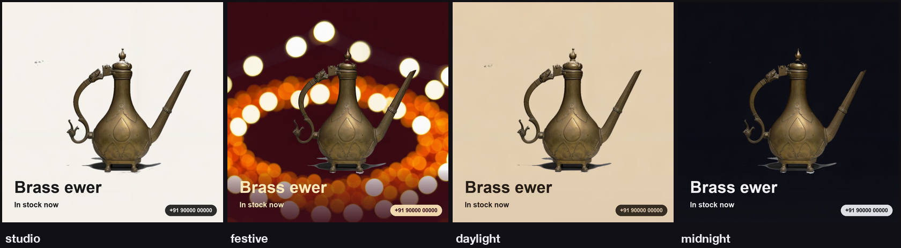
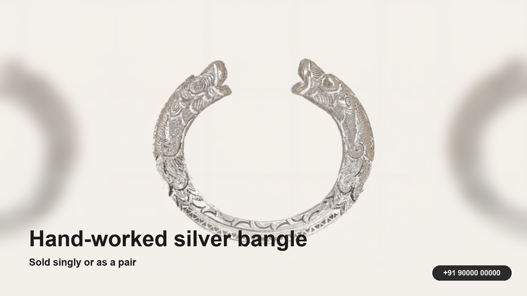

# Dukaan

### One product photo into three still-image advertising creatives, using AMD Radeon.

**Track 1, Development of Multimodal Content Creation Tools**
himanshu748 | Radeon PRO gfx1100, 48 GB | ROCm 7.2.4 | LTX-2.3 22B

---

## The problem

A shopkeeper can photograph stock quickly, but adapting one photo into legible
feed, story, and banner layouts still takes design work. Generative tools can
also change the product being advertised, so their output must be reviewed
against the item the seller will actually ship.

## What Dukaan does

One photo becomes a square for the feed, a 9:16 story, and a wide banner for a
shop header. Candidate frames, a GIF preview, and optional audio can be retained
for inspection and relabelling; they are not claimed as finished moving-media
deliverables. The price and phone number are composited with Pillow after
inference, never drawn by the model.

**The GPU backend is invoked once per pack, not once per format.** Three formats
select different moments from the same candidate sequence. The optional refine
setting performs an additional denoise pass inside that invocation.

One submitted photo across four fixed style presets:

---

## The finding: the instance cannot run its own template

| | |
|---|---|
| LTX-2.3 checkpoint | 43 GB |
| Gemma 3 12B text encoder | 23 GB |
| **Total to load** | **66 GB** |
| **Container cap** | **55 GB** |

ComfyUI holds every model a graph touches for the life of the process. Loading
both trips the cap and **the platform restarts the container mid-prompt**:
JupyterLab returns with zero kernels, the port stops answering, and it presents
as a network fault.

## The fix: two processes that never overlap

| phase | peak container RAM | wall |
|---|---|---|
| encode, text encoder only | 35.4 GB | 33 s |
| sample, checkpoint only | 49.9 GB in the committed benchmark | about 55 s |
| *stock template, one process* | *trips 55 GB, restarts* | *n/a* |

Peak becomes `max(43, 23)`, not `43 + 23`.

Plus: bf16 conditioning (it is read back while the checkpoint is resident),
VRAM eviction before the VAE decode (the decode died with 2.13 GB free out of
47.98), and `torch.inference_mode()` around the phase (the LTX VAE updates the
sampler's output in place).

---

## Measured

| setting | output | GPU | peak RAM |
|---|---|---|---|
| 768x768, 49 frames | 768x768 | 70.7 s | 49.9 GB |
| 768x768, refined | **1536x1536** | 176.1 s | 49.9 GB |
| 3 products, one batch | 768x768 | **134.3 s** | 49.9 GB |

The committed runs held under the 55 GB cap. `dukaan bench` reruns the matrix on
configured hardware; these historical measurements are not a performance
guarantee.

Transport was a bottleneck too: 49 frames as 49 base64 requests took 3 m 34 s
and reset the tunnel twice. One tar brought it to 2 m 19 s.

## Batching is the lever that removes work rather than trading it

Loading the checkpoint costs 17 s and the text encoder 9 s, whatever you then
generate. A shop packing fifty items one at a time pays that fifty times.

| | |
|---|---|
| 3 products, one batch | **134.3 s** |
| 3 products, separately | 212.1 s estimated baseline |
| per-product, across the batch | 36.3 s, then 28.0 s, then 26.6 s |

The 13.8 s load is paid once, and per-product time fell as the GPU warmed in the
submitted batch. The 212.1-second comparison is calculated as three times the
recorded 70.7-second single-product row; it is not three separately timed runs.

---

## Three CPU decisions that keep GPU credits for the GPU

**The cutout fits the background, it does not sample it.** A quadratic surface
per channel on the border ring, refit once with the worst residuals dropped. A
plane left an elliptical pool of backdrop exactly where the product sits.

**Stills are picked for spread, then sharpness.** Contiguous windows, highest
Laplacian variance in each. Frame 0 is never eligible: it is the plate the model
was handed.

**Reshaping mirrors, it does not crop or stretch.** Cover-cropping a square to
9:16 cuts the product; clamping the edge row drew the bokeh into horizontal
streaks.

---

**37 tests, no GPU required.** Without an instance configured, a deterministic
CPU mock exercises command flow, file writing, layout, and selection. It does
not validate LTX-2.3 quality, Radeon compatibility, product identity, or the
historical benchmark. Generated creatives require review before publication.
Apache-2.0. Demo photographs are CC0.
